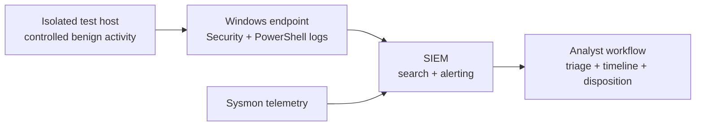

# SOC Home Lab

**Status:** One investigation and three detection specifications complete  
**Project source:** Coursework-derived case study plus independent extensions

## Overview

An isolated security operations lab for collecting endpoint telemetry, building detections, investigating alerts, and writing incident reports.

## Reference architecture

## Detection roadmap

| Detection | Data source | Framework mapping | Status |
|---|---|---|---|
| [Container traffic anomaly investigation](case-studies/container-traffic-anomaly-investigation.md) | Packet capture and derived traffic features | Behavioral anomaly analysis | Complete |
| [Repeated failed logons](detections/repeated-failed-logons.md) | Windows Security logs | ATT&CK T1110 | Specification complete |
| [New local administrator](detections/new-local-administrator.md) | Windows Security logs | ATT&CK T1098 | Specification complete |
| [Suspicious PowerShell](detections/suspicious-powershell.md) | PowerShell and process telemetry | ATT&CK T1059.001 | Specification complete |

## Workflow

1. Define a hypothesis and required telemetry.
2. Generate benign, controlled test events.
3. Write a query and document its field assumptions.
4. Define positive, negative, and false-positive tests.
5. Document false positives, limitations, and response actions.

## Skills demonstrated

Log onboarding, Windows telemetry, SIEM queries, detection engineering, alert triage, incident documentation.

## Safety

Testing is limited to systems I own or am authorized to use. No live targets, credentials, malware, private logs, or sensitive data are included. Detection documents are labeled as specifications rather than falsely presented as production-tested alerts.
